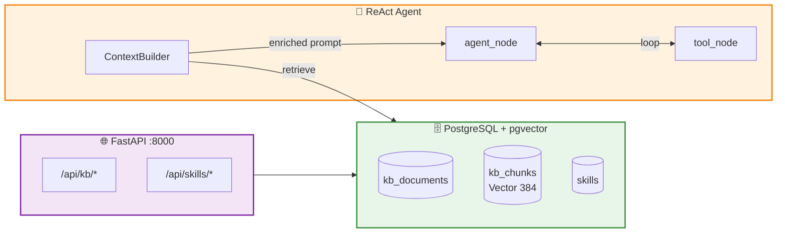

# WATI Conductor

> AI agent that translates natural language into WATI WhatsApp API workflows using LangGraph ReAct pattern

[](https://www.python.org/downloads/)
[](https://github.com/langchain-ai/langgraph)

## Overview

WATI Conductor is an AI agent that translates natural language instructions into executable WATI WhatsApp API workflows. Built with LangGraph's **ReAct (Reasoning + Acting)** pattern, the LLM reasons step-by-step — calling one tool at a time, observing the result, and deciding what to do next.

The agent is enhanced by a **Knowledge Base** (SOPs, guardrails, domain knowledge) and a **Skills system** that dynamically controls which tools and instructions are active.

## Why This Matters

Traditional API automation requires technical knowledge of endpoints, parameters, and error handling. WATI Conductor removes these barriers — business users describe what they want in plain English, and the agent handles the rest.

```bash
# Instead of writing API integration code:
You: Find all VIP contacts and send them the welcome_wati template
# Agent reasons through it step-by-step, adapting to results
# KB provides: "VIP contacts must receive templates in their preferred language"
```

## Quick Start

```bash
# Configure
cp .env.example .env
# Edit .env with your LLM API key (see Configuration)

# Start services (PostgreSQL + pgvector)
docker compose up -d postgres

# Install dependencies
poetry install

# Start the API server (KB + Skills management)
poetry run uvicorn conductor.api.main:app --host 0.0.0.0 --port 8000

# Start the agent (interactive mode)
python -m conductor.cli
```

## Knowledge Base

The KB stores SOPs, guardrails, and domain knowledge that the agent retrieves via semantic search to make better decisions.

### Architecture

```
User instruction → embed query → pgvector similarity search → top-K chunks → inject into system prompt → LLM reasons with context
```

### Managing the KB

The KB is managed via the FastAPI API (default: `http://localhost:8000`).

#### Ingest a file

```bash
curl -X POST http://localhost:8000/api/kb/documents/file \
  -H "Content-Type: application/json" \
  -d '{
    "file_path": "/path/to/sop.md",
    "category": "sop",
    "tags": ["vip", "contacts"],
    "always_inject": false
  }'
# → {"id": "uuid", "title": "Sop", "chunk_count": 5}
```

#### Ingest a directory (bulk)

```bash
curl -X POST http://localhost:8000/api/kb/documents/directory \
  -H "Content-Type: application/json" \
  -d '{
    "dir_path": "./data/kb/sops",
    "category": "sop",
    "tags": ["operations"]
  }'
# → {"ingested": 3, "documents": [...]}
```

#### Ingest raw text

```bash
curl -X POST http://localhost:8000/api/kb/documents/text \
  -H "Content-Type: application/json" \
  -d '{
    "title": "Batch Limit Rule",
    "content": "Never send more than 500 messages in a single batch.",
    "category": "guardrail",
    "tags": ["limits"],
    "always_inject": true
  }'
```

#### Search the KB (semantic)

```bash
curl -X POST http://localhost:8000/api/kb/search \
  -H "Content-Type: application/json" \
  -d '{"query": "how to handle VIP contacts", "top_k": 3}'
# → {"results": [{"content": "...", "title": "Vip Handling", "similarity": 0.65}, ...]}
```

#### List documents

```bash
curl http://localhost:8000/api/kb/documents
curl http://localhost:8000/api/kb/documents?category=sop
curl http://localhost:8000/api/kb/documents?tag=vip
```

#### Delete a document

```bash
curl -X DELETE http://localhost:8000/api/kb/documents/{doc_id}
```

#### Get always-inject guardrails

```bash
curl http://localhost:8000/api/kb/guardrails
```

### Document Categories

| Category | Purpose | Retrieval |
|----------|---------|-----------|
| `sop` | Standard operating procedures | Semantic search per instruction |
| `guardrail` | Hard constraints and limits | Always injected (if `always_inject=true`) + semantic |
| `domain` | Reference data (templates, teams) | Semantic search per instruction |
| `faq` | Common questions and answers | Semantic search per instruction |

### Sample KB Content

Pre-built SOPs are in `data/kb/`:

```
data/kb/
├── guardrails/
│   └── limits.md          # Batch limits, data protection, rate limits
├── sops/
│   ├── batch-messaging.md # 5-step batch send procedure
│   ├── vip-handling.md    # VIP contact management
│   └── contact-management.md  # Search, tag, update procedures
└── domain/
    ├── template-catalog.md    # Template names, params, usage guide
    └── team-structure.md      # Teams, assignment rules, escalation
```

## Skills Management

Skills are named bundles of **tools + instructions**. They control what the agent can do and how it behaves.

### Viewing Skills

```bash
curl http://localhost:8000/api/skills
# → 5 builtin skills: contacts (8 tools), messaging (2), templates (2), operators (2), tickets (2)
```

### Disable/Enable a Skill

```bash
# Disable tickets — agent can no longer create/resolve tickets
curl -X PATCH http://localhost:8000/api/skills/tickets \
  -H "Content-Type: application/json" \
  -d '{"enabled": false}'

# Check active tools (should be 14 instead of 16)
curl http://localhost:8000/api/skills/active/tools

# Re-enable
curl -X PATCH http://localhost:8000/api/skills/tickets \
  -H "Content-Type: application/json" \
  -d '{"enabled": true}'
```

### Create a Custom Skill

```bash
curl -X POST http://localhost:8000/api/skills \
  -H "Content-Type: application/json" \
  -d '{
    "name": "marketing",
    "description": "Marketing campaign tools and guidelines",
    "tool_names": ["send_template_message_batch", "list_templates"],
    "instructions": "When sending marketing templates:\n- Check opt-in status first\n- Never send outside business hours (9-18)"
  }'
```

### Update Skill Instructions

```bash
curl -X PATCH http://localhost:8000/api/skills/messaging \
  -H "Content-Type: application/json" \
  -d '{"instructions": "Always confirm before sending to more than 50 contacts."}'
```

### Built-in Skills

| Skill | Tools | Description |
|-------|-------|-------------|
| `contacts` | 8 | Contact search, tagging, attribute management |
| `messaging` | 2 | Send session messages and template broadcasts |
| `templates` | 2 | Browse and inspect message templates |
| `operators` | 2 | Assign conversations to operators/teams |
| `tickets` | 2 | Create and resolve support tickets |

## How It Works — ReAct Loop

The agent uses a **think → act → observe** loop:

```
User: "Find all VIP contacts and send them the welcome_wati template"

  Iteration 1 — Think: I need to find VIP contacts first
                Act:   search_contacts(tag="VIP")
                Observe: {contacts: [...], total: 10}

  Iteration 2 — Think: Found 10 contacts, now send the template
                Act:   send_template_message_batch(contacts=[...], template="welcome_wati")
                Observe: {sent: 10, failed: 0}

  Iteration 3 — Think: Both steps done, summarize
                Respond: "Found 10 VIP contacts and sent welcome_wati to all of them."
```

## Usage

### Interactive Mode (Recommended)

```bash
python -m conductor.cli

You: trust
Trust mode enabled ✓

You: What templates do I have?
💬 Response: You have 6 message templates available...

You: Find all VIP contacts and send them the welcome_wati template
💬 Response: Found 10 VIP contacts and sent welcome_wati to all of them.

You: quit
```

### Single-Shot Mode

```bash
python -m conductor.cli "Find all VIP contacts"
python -m conductor.cli "Send welcome_wati to VIPs" --dry-run
python -m conductor.cli "Send welcome_wati to VIPs" --trust
```

| Flag | Description |
|------|-------------|
| `--dry-run` | Show first planned tool call without executing |
| `--trust` | Auto-approve all tool executions |
| `--verbose` | Enable debug logging |

## Configuration

All settings in `.env`:

```bash
# LLM (DeepSeek v4 Pro recommended for ReAct reasoning)
LLM_REACT_MODEL=deepseek-v4-pro
DEEPSEEK_API_KEY=sk-your-key

# PostgreSQL (for KB + Skills)
POSTGRES_HOST=localhost
POSTGRES_PORT=5432
POSTGRES_USER=conductor
POSTGRES_PASSWORD=conductor
POSTGRES_DB=wati_conductor

# Knowledge Base
KB_ENABLED=true
KB_EMBEDDING_MODEL=all-MiniLM-L6-v2
KB_TOP_K=5

# WATI API (mock mode works without credentials)
USE_MOCK=true
```

## Architecture



## Project Structure

```
wati-conductor/
├── conductor/
│   ├── agent/              # ReAct LangGraph loop
│   ├── api/                # FastAPI service (KB + Skills endpoints)
│   ├── db/                 # SQLAlchemy models + async session pool
│   ├── kb/                 # Ingestion, embedding, retrieval
│   ├── skills/             # Registry, builtin definitions
│   ├── tools/              # 16 LangChain @tool functions
│   ├── clients/            # Mock + Real WATI API clients
│   ├── models/             # Pydantic models (state, intent, wati)
│   ├── cli.py              # Click CLI (REPL + single-shot)
│   └── config.py           # Settings from .env
├── data/kb/                # Sample SOPs, guardrails, domain docs
├── docs/                   # Full documentation (mkdocs)
├── tests/
├── mock_data/              # 50 contacts, 6 templates
├── docker-compose.yaml     # PostgreSQL + pgvector + conductor
└── pyproject.toml
```

## Development

```bash
poetry install

# Start PostgreSQL
docker compose up -d postgres

# Run API server
poetry run uvicorn conductor.api.main:app --reload --port 8000

# Run tests
pytest tests/ -v

# Code quality
black conductor/ tests/
ruff check conductor/
```

## Roadmap

- [x] ReAct agent with LangGraph (v3)
- [x] 16 LangChain tools
- [x] Mock WATI client (50 contacts, 6 templates)
- [x] Rich CLI with dry-run, trust mode
- [x] Docker deployment
- [x] **Knowledge Base** — PostgreSQL + pgvector, semantic search, SOPs/guardrails
- [x] **Skills Management** — enable/disable tool groups, custom skills
- [ ] Agent integration — ContextBuilder wiring KB into ReAct system prompt
- [ ] Streaming responses
- [ ] Real WATI API integration testing
- [ ] Web UI (chat interface)
- [ ] LangSmith tracing
- [ ] Session persistence (LangGraph checkpointer)

## License

MIT License
