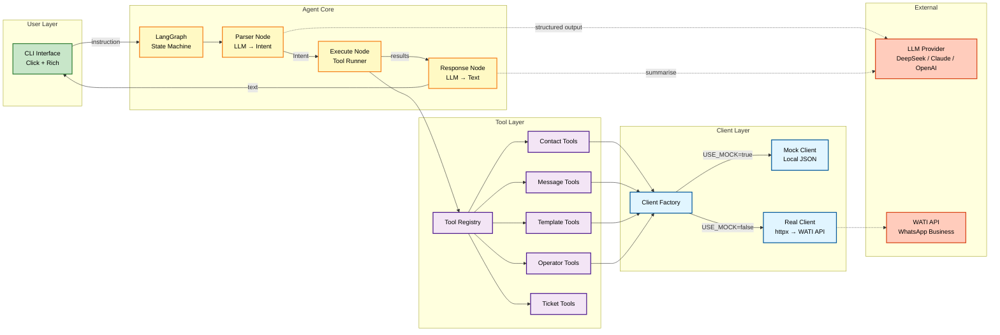
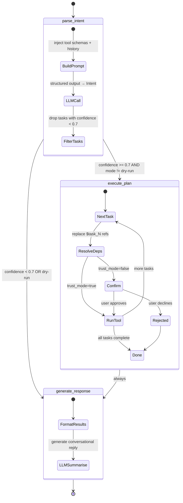
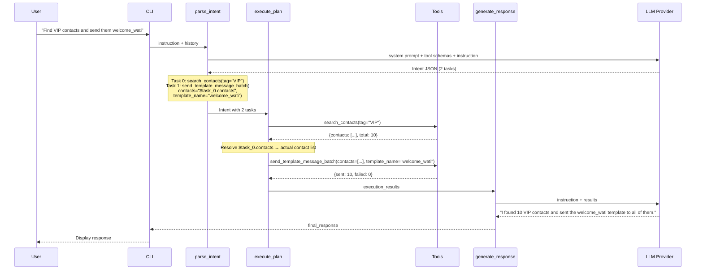
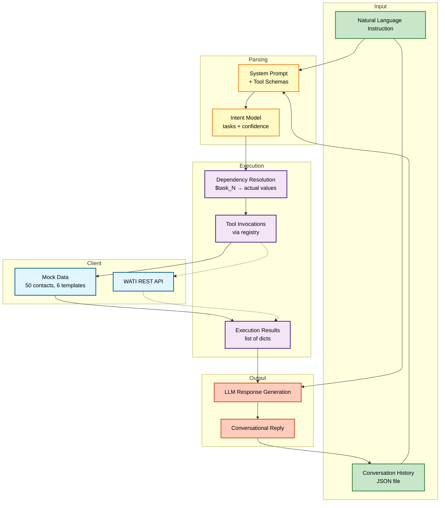
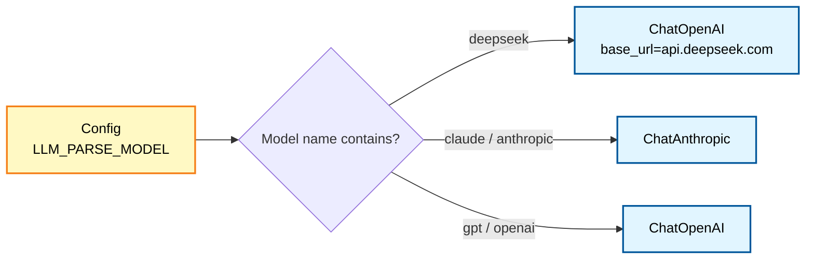

# Architecture

## High-Level Architecture

WATI Conductor is a single-process AI agent that converts natural language into WATI WhatsApp API workflows. The LLM handles both instruction parsing and response generation; everything in between is deterministic.



## LangGraph State Machine

The agent uses a 3-node LangGraph graph. This is a deliberate simplification from the original v1 design (6 nodes) — the LLM handles planning directly, eliminating separate planner, validator, and clarifier nodes.



### Node Responsibilities

| Node | File | LLM Call? | Purpose |
|---|---|---|---|
| `parse_intent` | `agent/parser.py` | Yes (structured output) | Decompose instruction into `Intent` with `Task[]` |
| `execute_plan` | `agent/nodes/execute.py` | No | Run tools sequentially, resolve `$task_N` references |
| `generate_response` | `agent/nodes/response.py` | Yes | Summarise results as natural language |

### State Schema (`AgentState`)

```python
class AgentState(TypedDict, total=False):
    instruction: str                    # User's natural language input
    mode: Literal["execute", "dry-run"] # Execution mode
    trust_mode: bool                    # Skip confirmations
    intent: Intent | None               # Parsed tasks from LLM
    execution_results: list[dict]       # Tool outputs per step
    execution_errors: list[dict]        # Errors per step
    user_rejected: bool                 # User declined a tool
    rejected_tool: str                  # Which tool was declined
    final_response: str                 # LLM-generated reply
    success: bool                       # Overall success flag
```

## Multi-Task Execution Flow

The key innovation is inter-task dependency resolution via `$task_N.field` references. The LLM generates these references during parsing; the executor resolves them at runtime.



## Data Flow



## Architecture Evolution: v1 → v2

### v1 (6 nodes — rule-based planner)

```
parse → plan → validate → execute → clarify → response
```

- Fixed action types (10 predefined)
- Rule-based plan generation in `planner.py`
- Separate validation node for parameter checking
- Clarification node for ambiguous input
- ~1,200 lines of code

### v2 (3 nodes — LLM-first)

```
parse → execute → response
```

- Dynamic tool selection (any registered tool)
- LLM generates tasks directly with structured output
- Confidence filtering replaces validation
- ~700 lines of code (~40% reduction)

The planner, validator, and clarifier nodes still exist in `agent/nodes/` but are no longer wired into the graph. They remain as reference code.

## LLM Provider Routing

The `llm_factory.py` module routes to different providers based on the model name in config:



Switch providers by changing one env var — no code changes needed:

```bash
LLM_PARSE_MODEL=deepseek-chat      # Default, cheapest ($0.014/1M tokens)
LLM_PARSE_MODEL=claude-3-5-sonnet-20241022  # Higher quality
LLM_PARSE_MODEL=gpt-4o             # OpenAI alternative
```

## Communication Patterns

| Pattern | Used Between | Mechanism |
|---|---|---|
| Structured output | Parser → LLM | Pydantic model via `with_structured_output(Intent)` |
| Tool invocation | Executor → Tools | LangChain `@tool` decorated async functions |
| Client abstraction | Tools → WATI API | Protocol class (`WATIClient`) with mock/real implementations |
| State passing | Node → Node | LangGraph `AgentState` TypedDict |
| Conversation history | CLI → Parser | JSON file read via `history.py` |
