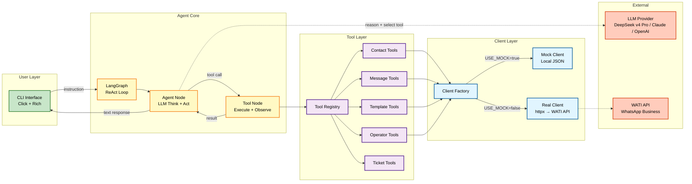
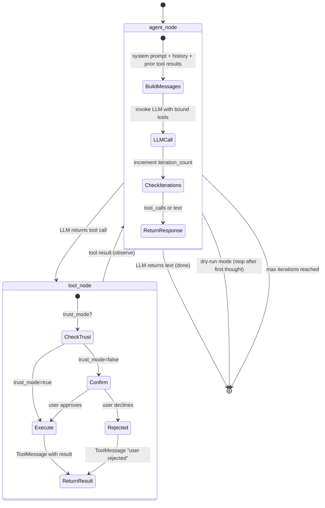
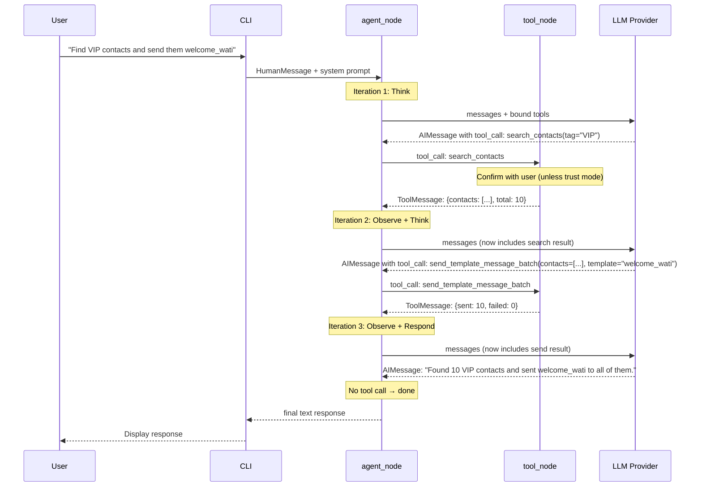
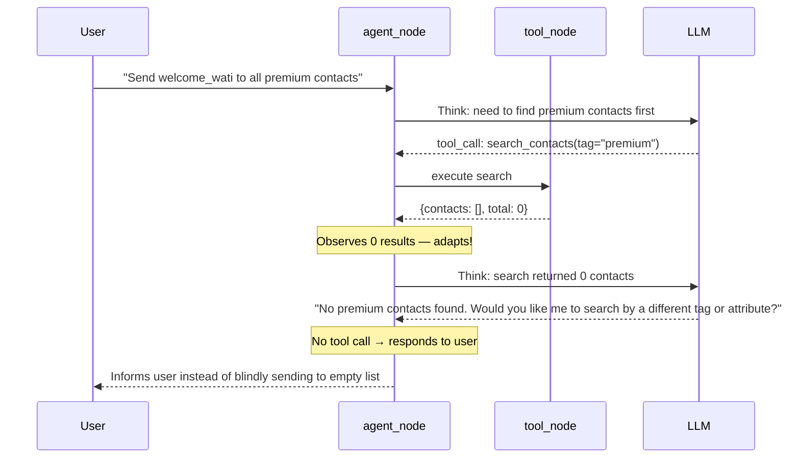
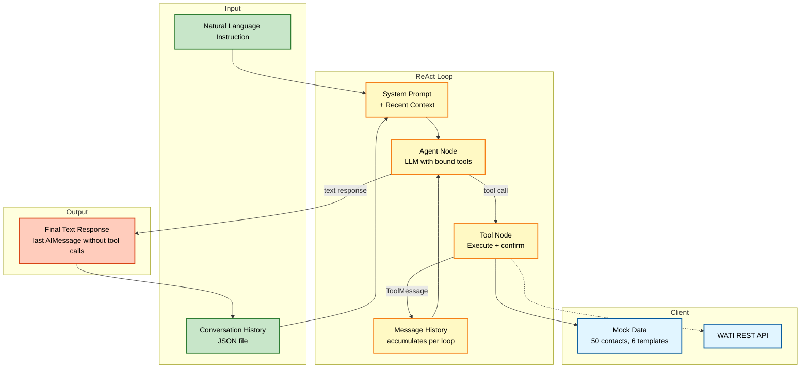
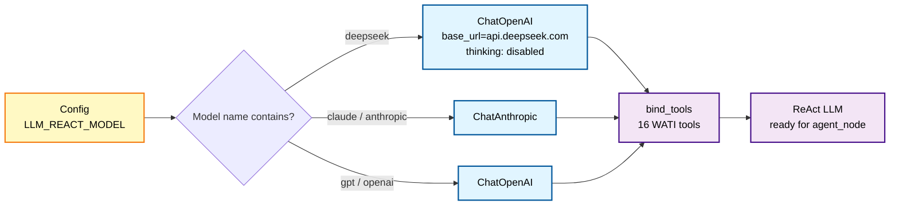

# Architecture

## High-Level Architecture

WATI Conductor is a single-process AI agent that converts natural language into WATI WhatsApp API workflows. It uses a **ReAct (Reasoning + Acting) loop** — the LLM reasons about each step, calls one tool, observes the result, and decides what to do next.



## LangGraph ReAct State Machine

The agent uses a 2-node LangGraph loop implementing the standard ReAct pattern. The LLM decides one action at a time, observes the result, and continues until it responds with plain text (no tool call).



### Node Responsibilities

| Node | File | LLM Call? | Purpose |
|---|---|---|---|
| `agent_node` | `agent/react_nodes.py` | Yes (tool calling) | Reason about current state, select one tool or respond with text |
| `tool_node` | `agent/react_nodes.py` | No | Execute the selected tool, return result as `ToolMessage` |

### State Schema (`AgentState`)

```python
class AgentState(TypedDict, total=False):
    messages: Annotated[list[AnyMessage], add_messages]  # All conversation messages
    iteration_count: int          # Think-act-observe cycles completed
    trust_mode: bool              # Skip per-tool confirmation prompts
    mode: Literal["execute", "dry-run"]  # Execution mode
    user_rejected: bool           # User declined a tool execution
    rejected_tool: str            # Which tool was declined
```

The key difference from the previous architecture: instead of separate fields for intent, execution results, and errors, **everything lives in the `messages` list** as LangChain message objects (`SystemMessage`, `HumanMessage`, `AIMessage`, `ToolMessage`). This is the standard LangGraph ReAct pattern.

## ReAct Execution Flow

The LLM reasons through multi-step instructions one tool call at a time, observing each result before deciding the next action.



### Dynamic Adaptation Example

Unlike Plan-then-Execute, the ReAct agent adapts to unexpected results:



## Data Flow



## Architecture Evolution

### v1 (6 nodes — rule-based planner)

```
parse → plan → validate → execute → clarify → response
```

- Fixed action types (10 predefined)
- Rule-based plan generation in `planner.py`
- Separate validation node for parameter checking
- ~1,200 lines of code

### v2 (3 nodes — LLM-first plan-then-execute)

```
parse_intent → execute_plan → generate_response
```

- LLM generates all tasks upfront via structured output
- Sequential execution with `$task_N` dependency resolution
- 2 LLM calls per instruction (parse + response)
- ~700 lines of code

### v3 (2 nodes — ReAct loop) ← **current**

```
agent_node ↔ tool_node (loop until done)
```

- LLM reasons step-by-step, one tool call at a time
- Each tool result feeds back to LLM for observation
- Dynamic replanning — adapts to unexpected results
- N LLM calls per instruction (one per think-act-observe cycle)
- ~200 lines of agent code (react_graph.py + react_nodes.py)

### Why ReAct over Plan-then-Execute

| Aspect | Plan-then-Execute (v2) | ReAct (v3) |
|---|---|---|
| Planning | Single LLM call generates ALL tasks upfront | LLM decides ONE action at a time |
| Execution | Sequential, no LLM involvement | Each tool result feeds back to LLM |
| Adaptation | None — can't adjust if tool returns unexpected results | LLM observes results and adapts dynamically |
| Error handling | Stops on first error | LLM reasons about errors and tries alternatives |
| LLM calls | 2 per instruction | N per instruction (one per cycle) |
| Code complexity | Custom parser, dependency resolver, response generator | Standard LangGraph ReAct pattern |

## LLM Provider Routing

The `llm_factory.py` module routes to different providers based on the model name in config:



Switch providers by changing one env var — no code changes needed:

```bash
LLM_REACT_MODEL=deepseek-v4-pro    # Default, strong reasoning
LLM_REACT_MODEL=deepseek-v4-flash  # Cheaper, faster
LLM_REACT_MODEL=claude-3-5-sonnet-20241022  # Anthropic
LLM_REACT_MODEL=gpt-4o             # OpenAI
```

DeepSeek v4 models have thinking mode explicitly disabled (`{"thinking": {"type": "disabled"}}`) to avoid conflicts with temperature settings and reduce latency in the multi-call ReAct loop.

## Communication Patterns

| Pattern | Used Between | Mechanism |
|---|---|---|
| Native tool calling | Agent → LLM | `model.bind_tools(tools)` — LLM returns `tool_calls` in response |
| Tool execution | Tool node → Tools | LangChain `@tool` decorated async functions via registry |
| Client abstraction | Tools → WATI API | Protocol class (`WATIClient`) with mock/real implementations |
| Message passing | Node → Node | LangGraph `AgentState.messages` list with `add_messages` reducer |
| Conversation history | CLI → Agent | JSON file read via `history.py`, injected into system prompt |
| Human-in-the-loop | Tool node → User | Console prompt before each tool execution (unless trust mode) |
