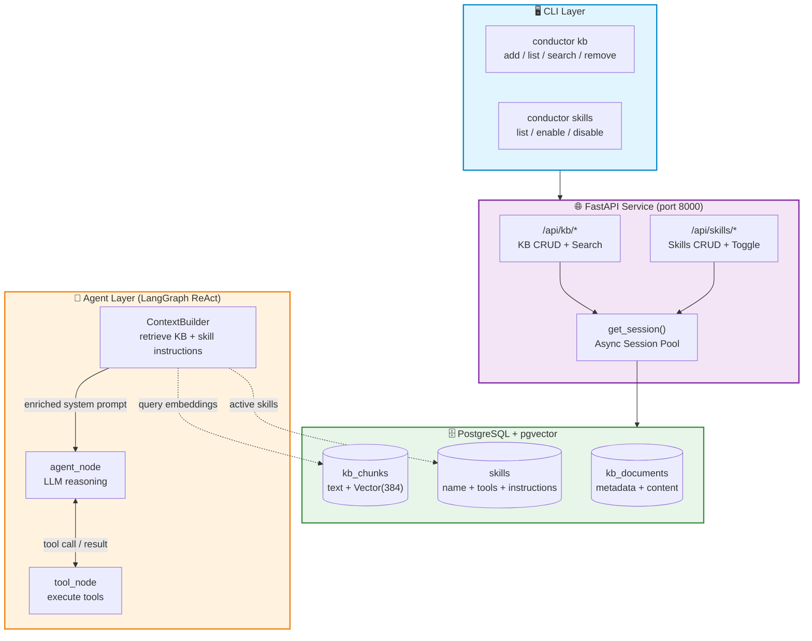
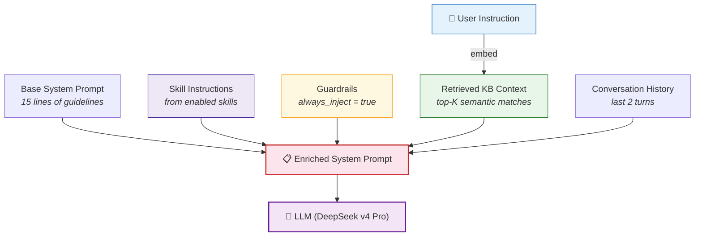
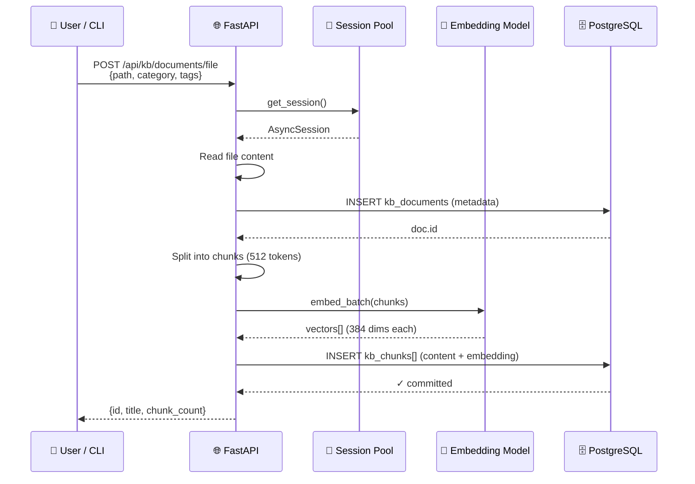
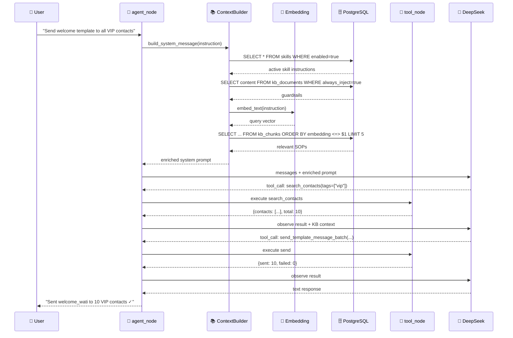

# Design: Knowledge Base Management & Skills Management

> Architecture decisions, data models, and integration design for KB and Skills features in WATI Conductor.

## Architecture Overview



## Key Design Decisions

### D1: PostgreSQL + pgvector as the Only Backend

**Decision**: Use PostgreSQL with pgvector extension for all storage — metadata, chunks, embeddings, and skill state. No ChromaDB, no SQLite.

**Rationale**:

- Enterprise-grade: ACID, backups, replication, row-level security
- Single dependency: one DB for metadata + vectors (no separate vector DB service)
- pgvector HNSW index handles millions of embeddings at ~10-50ms search
- Consistent with existing infrastructure patterns (user's cbd project uses the same stack)
- Docker Compose makes local dev trivial — same setup as production

### D2: FastAPI Service with Async Session Pool

**Decision**: KB and Skills operations go through a FastAPI service layer with SQLAlchemy async engine + connection pool via dependency injection.

**Rationale**:

- Connection pool avoids per-request connection overhead
- Matches user's established pattern (`create_async_engine` + `async_sessionmaker` + `get_session()` DI)
- FastAPI endpoints serve both the CLI (via HTTP calls) and future Web UI
- Async throughout — no blocking in the ReAct loop

### D3: SQLAlchemy ORM for Table Models

**Decision**: Define all tables using SQLAlchemy 2.0 `DeclarativeBase` with `Mapped` type annotations.

**Rationale**:

- Type-safe column definitions
- Relationship management (document → chunks cascade delete)
- Migration support via Alembic (future)
- Consistent with user's existing codebase pattern

### D4: Pre-Retrieval Enrichment (not a new graph node)

**Decision**: `ContextBuilder` calls the KB API before the first `agent_node` invocation. No new LangGraph node.

**Rationale**: V4 = Option A from roadmap. The agent's system prompt gets enriched with retrieved KB content. Graph topology stays unchanged.

### D5: Skills as DB Records (not YAML files)

**Decision**: Skills are stored in PostgreSQL, not as YAML files on disk. CLI/API manages them.

**Rationale**:

- Single source of truth (DB)
- No file-system state to sync
- Queryable (list enabled skills, filter by tag)
- Consistent with KB storage approach

### D6: Embedding Model — BAAI/bge-m3 (local, free)

**Decision**: Use `BAAI/bge-m3` via `sentence-transformers` locally. 1024 dimensions.

**Rationale**:

- No API key required — runs entirely local
- Multilingual (handles Chinese SOPs and English equally well)
- High quality (top-tier on MTEB benchmarks)
- Zero cost per embedding — no per-token charges
- ~50ms/chunk on GPU, ~200ms on CPU — acceptable for batch ingestion
- Model downloaded once (~2GB), cached locally

## SQLAlchemy Models

```python
# conductor/db/models.py

import uuid
from datetime import datetime

from pgvector.sqlalchemy import Vector
from sqlalchemy import Integer, String, Boolean, DateTime, Text, ForeignKey
from sqlalchemy.dialects.postgresql import UUID, ARRAY
from sqlalchemy.ext.asyncio import AsyncAttrs
from sqlalchemy.orm import DeclarativeBase, Mapped, mapped_column, relationship


class Base(AsyncAttrs, DeclarativeBase):
    """Base class for all WATI Conductor models."""


class KBDocument(Base):
    """Knowledge base document metadata.

    Fields:
        id: UUID primary key
        title: Human-readable document title
        category: sop | guardrail | domain | faq
        tags: Free-form tags for filtering
        content: Full raw document content
        source_path: Original file path (if ingested from file)
        skill_id: Associated skill (nullable)
        always_inject: If True, always included in system prompt
        created_at: Ingestion timestamp
        updated_at: Last modification timestamp
    """
    __tablename__ = "kb_documents"

    id: Mapped[uuid.UUID] = mapped_column(
        UUID(as_uuid=True), primary_key=True, default=uuid.uuid4
    )
    title: Mapped[str] = mapped_column(String, nullable=False)
    category: Mapped[str] = mapped_column(String, nullable=False)
    tags: Mapped[list[str]] = mapped_column(ARRAY(String), default=list)
    content: Mapped[str] = mapped_column(Text, nullable=False)
    source_path: Mapped[str | None] = mapped_column(String)
    skill_id: Mapped[uuid.UUID | None] = mapped_column(
        UUID(as_uuid=True), ForeignKey("skills.id", ondelete="SET NULL")
    )
    always_inject: Mapped[bool] = mapped_column(Boolean, default=False)
    created_at: Mapped[datetime] = mapped_column(
        DateTime(timezone=True), default=datetime.utcnow
    )
    updated_at: Mapped[datetime] = mapped_column(
        DateTime(timezone=True), default=datetime.utcnow, onupdate=datetime.utcnow
    )

    chunks = relationship("KBChunk", back_populates="document", cascade="all, delete-orphan")
    skill = relationship("Skill", back_populates="kb_documents")


class KBChunk(Base):
    """Embedded chunk of a KB document for vector search.

    Fields:
        id: UUID primary key
        document_id: Parent document reference
        chunk_index: Position within the document
        content: Chunk text content
        embedding: pgvector embedding (1024 dimensions for BAAI/bge-m3)
        created_at: Embedding timestamp
    """
    __tablename__ = "kb_chunks"

    id: Mapped[uuid.UUID] = mapped_column(
        UUID(as_uuid=True), primary_key=True, default=uuid.uuid4
    )
    document_id: Mapped[uuid.UUID] = mapped_column(
        UUID(as_uuid=True), ForeignKey("kb_documents.id", ondelete="CASCADE")
    )
    chunk_index: Mapped[int] = mapped_column(Integer, nullable=False)
    content: Mapped[str] = mapped_column(Text, nullable=False)
    embedding: Mapped[list[float]] = mapped_column(Vector(1024))
    created_at: Mapped[datetime] = mapped_column(
        DateTime(timezone=True), default=datetime.utcnow
    )

    document = relationship("KBDocument", back_populates="chunks")


class Skill(Base):
    """Registered skill with tools, instructions, and KB associations.

    Fields:
        id: UUID primary key
        name: Unique skill identifier
        version: Semantic version string
        description: Human-readable description
        enabled: Whether skill is active
        tool_names: List of tool function names this skill provides
        instructions: Skill-specific system prompt additions
        depends_on: List of skill names this depends on
        builtin: True for built-in skills (cannot be deleted)
        created_at: Registration timestamp
        updated_at: Last modification timestamp
    """
    __tablename__ = "skills"

    id: Mapped[uuid.UUID] = mapped_column(
        UUID(as_uuid=True), primary_key=True, default=uuid.uuid4
    )
    name: Mapped[str] = mapped_column(String, unique=True, nullable=False)
    version: Mapped[str] = mapped_column(String, default="1.0")
    description: Mapped[str] = mapped_column(Text, default="")
    enabled: Mapped[bool] = mapped_column(Boolean, default=True)
    tool_names: Mapped[list[str]] = mapped_column(ARRAY(String), default=list)
    instructions: Mapped[str] = mapped_column(Text, default="")
    depends_on: Mapped[list[str]] = mapped_column(ARRAY(String), default=list)
    builtin: Mapped[bool] = mapped_column(Boolean, default=False)
    created_at: Mapped[datetime] = mapped_column(
        DateTime(timezone=True), default=datetime.utcnow
    )
    updated_at: Mapped[datetime] = mapped_column(
        DateTime(timezone=True), default=datetime.utcnow, onupdate=datetime.utcnow
    )

    kb_documents = relationship("KBDocument", back_populates="skill")
```

## Database Session Management

```python
# conductor/db/session.py

from typing import AsyncGenerator

from sqlalchemy.ext.asyncio import AsyncSession, create_async_engine, async_sessionmaker

from conductor.config import settings


ENGINE = create_async_engine(
    url=settings.database_url,
    echo=False,
    pool_pre_ping=True,
    pool_recycle=2000,
    pool_size=5,
    pool_timeout=15,
    max_overflow=10,
)

async_session = async_sessionmaker(
    bind=ENGINE,
    expire_on_commit=False,
    autocommit=False,
)


async def get_session() -> AsyncGenerator[AsyncSession, None]:
    """Dependency injection for async DB session."""
    async with async_session() as session:
        yield session
```

## Configuration Additions

```python
# In conductor/config.py — new fields
class Settings(BaseSettings):
    # ... existing fields ...

    # PostgreSQL
    postgres_host: str = "localhost"
    postgres_port: int = 5432
    postgres_user: str = "conductor"
    postgres_password: str = "conductor"
    postgres_db: str = "wati_conductor"

    # Knowledge Base
    kb_enabled: bool = True
    kb_embedding_model: str = "BAAI/bge-m3"
    kb_top_k: int = 5
    kb_chunk_size: int = 512
    kb_chunk_overlap: int = 64

    # Skills
    skills_enabled: bool = True

    @property
    def database_url(self) -> str:
        """Build async PostgreSQL connection URL."""
        return (
            f"postgresql+asyncpg://{self.postgres_user}:{self.postgres_password}"
            f"@{self.postgres_host}:{self.postgres_port}/{self.postgres_db}"
        )
```

## FastAPI Service

```python
# conductor/api/main.py

from contextlib import asynccontextmanager

from fastapi import FastAPI

from conductor.db.models import Base
from conductor.db.session import ENGINE
from conductor.api.routes import kb, skills


@asynccontextmanager
async def lifespan(app: FastAPI):
    """Create tables on startup (pgvector extension must exist)."""
    async with ENGINE.begin() as conn:
        await conn.execute(text("CREATE EXTENSION IF NOT EXISTS vector"))
        await conn.run_sync(Base.metadata.create_all)
    yield


app = FastAPI(title="WATI Conductor API", lifespan=lifespan)
app.include_router(kb.router, prefix="/api/kb", tags=["knowledge-base"])
app.include_router(skills.router, prefix="/api/skills", tags=["skills"])
```

## API Endpoints

### Knowledge Base

| Method | Path | Description |
|---|---|---|
| `POST` | `/api/kb/documents` | Ingest document (upload file or raw text) |
| `GET` | `/api/kb/documents` | List documents (filter by category, tag) |
| `GET` | `/api/kb/documents/{id}` | Get document details |
| `DELETE` | `/api/kb/documents/{id}` | Delete document + chunks |
| `POST` | `/api/kb/search` | Semantic search (returns top-K chunks) |
| `GET` | `/api/kb/guardrails` | Get all always-inject guardrails |
| `POST` | `/api/kb/sync` | Bulk ingest from directory path |

### Skills

| Method | Path | Description |
|---|---|---|
| `GET` | `/api/skills` | List all skills |
| `POST` | `/api/skills` | Create/register a skill |
| `GET` | `/api/skills/{name}` | Get skill details |
| `PATCH` | `/api/skills/{name}` | Update skill (enable/disable, edit instructions) |
| `DELETE` | `/api/skills/{name}` | Delete skill (non-builtin only) |
| `GET` | `/api/skills/active/tools` | Get resolved tool list from enabled skills |

## Vector Search Query

```python
# conductor/kb/retriever.py

from sentence_transformers import SentenceTransformer
from sqlalchemy import select
from sqlalchemy.ext.asyncio import AsyncSession

from conductor.config import settings
from conductor.db.models import KBChunk, KBDocument

# Loaded once at module level — model stays in memory
_model: SentenceTransformer | None = None


def _get_embedding_model() -> SentenceTransformer:
    """Lazy-load the embedding model (cached after first call)."""
    global _model
    if _model is None:
        _model = SentenceTransformer(settings.kb_embedding_model)
    return _model


def embed_text(text: str) -> list[float]:
    """Embed a single text string using the local model.

    Args:
        text: Input text to embed.

    Returns:
        Embedding vector as list of floats (1024 dims for bge-m3).
    """
    model = _get_embedding_model()
    return model.encode(text, normalize_embeddings=True).tolist()


def embed_batch(texts: list[str]) -> list[list[float]]:
    """Embed multiple texts in a single batch (faster than one-by-one).

    Args:
        texts: List of text strings.

    Returns:
        List of embedding vectors.
    """
    model = _get_embedding_model()
    return model.encode(texts, normalize_embeddings=True).tolist()


async def search_similar(
    session: AsyncSession,
    query_embedding: list[float],
    top_k: int = 5,
    category: str | None = None,
) -> list[dict]:
    """Semantic search using pgvector cosine distance.

    Args:
        session: Async DB session from pool.
        query_embedding: Embedded query vector (1024 dims).
        top_k: Number of results to return.
        category: Optional category filter.

    Returns:
        List of {content, title, category, similarity} dicts.
    """
    stmt = (
        select(
            KBChunk.content,
            KBDocument.title,
            KBDocument.category,
            (1 - KBChunk.embedding.cosine_distance(query_embedding)).label("similarity"),
        )
        .join(KBDocument, KBChunk.document_id == KBDocument.id)
        .order_by(KBChunk.embedding.cosine_distance(query_embedding))
        .limit(top_k)
    )

    if category:
        stmt = stmt.where(KBDocument.category == category)

    result = await session.execute(stmt)
    return [dict(row._mapping) for row in result]
```

## Data Flow: System Prompt Enrichment



## Module Structure

```
conductor/
├── db/                          # NEW — Database layer
│   ├── __init__.py
│   ├── models.py                # SQLAlchemy ORM models (KBDocument, KBChunk, Skill)
│   └── session.py               # Engine + async_sessionmaker + get_session()
│
├── api/                         # NEW — FastAPI service
│   ├── __init__.py
│   ├── main.py                  # FastAPI app, lifespan, router registration
│   └── routes/
│       ├── __init__.py
│       ├── kb.py                # KB endpoints (ingest, search, list, delete)
│       └── skills.py            # Skills endpoints (CRUD, enable/disable)
│
├── kb/                          # NEW — KB business logic
│   ├── __init__.py
│   ├── ingestion.py             # File parsing, chunking, embedding
│   └── retriever.py             # Semantic search queries
│
├── skills/                      # NEW — Skills business logic
│   ├── __init__.py
│   ├── registry.py              # SkillRegistry — resolve active tools
│   └── builtin.py               # Built-in skill seed data
│
├── agent/
│   ├── react_nodes.py           # MODIFIED — _build_system_message uses ContextBuilder
│   ├── context_builder.py       # NEW — calls KB API, assembles enriched prompt
│   └── ...
│
├── tools/
│   ├── registry.py              # MODIFIED — delegates to SkillRegistry
│   ├── kb_tools.py              # NEW — search_knowledge, get_guardrails agent tools
│   └── ...
│
├── cli.py                       # MODIFIED — add kb and skills command groups
└── config.py                    # MODIFIED — add postgres + KB + skills settings
```

## Docker Compose

```yaml
# docker-compose.yaml (updated)
services:
  conductor:
    build: .
    env_file: .env
    depends_on:
      postgres:
        condition: service_healthy
    ports:
      - "8000:8000"

  postgres:
    image: pgvector/pgvector:pg16
    environment:
      POSTGRES_DB: wati_conductor
      POSTGRES_USER: conductor
      POSTGRES_PASSWORD: ${POSTGRES_PASSWORD:-conductor}
    ports:
      - "5432:5432"
    volumes:
      - pgdata:/var/lib/postgresql/data
    healthcheck:
      test: ["CMD-SHELL", "pg_isready -U conductor -d wati_conductor"]
      interval: 5s
      timeout: 5s
      retries: 5

volumes:
  pgdata:
```

## Integration: Agent ↔ KB API

The `ContextBuilder` calls the FastAPI KB endpoints internally (or directly uses the session if running in-process):

```python
# conductor/agent/context_builder.py

from conductor.db.session import async_session
from conductor.kb.retriever import search_similar, get_always_inject_guardrails, embed_text
from conductor.skills.registry import get_active_skills


class ContextBuilder:
    """Assembles enriched system prompt from KB and active skills."""

    async def build_system_message(self, user_instruction: str) -> str:
        """Build enriched system prompt.

        Sections (in order):
        1. Base SYSTEM_PROMPT
        2. Active skill instructions
        3. Always-on guardrails
        4. Retrieved KB context (semantic match to instruction)
        5. Conversation history
        """
        parts = [SYSTEM_PROMPT]

        async with async_session() as session:
            # Skill instructions
            active_skills = await get_active_skills(session)
            for skill in active_skills:
                if skill.instructions:
                    parts.append(f"\n## {skill.name} Guidelines\n{skill.instructions}")

            # Always-on guardrails
            guardrails = await get_always_inject_guardrails(session)
            if guardrails:
                parts.append(
                    "\n## Guardrails (MUST follow)\n"
                    + "\n".join(f"- {g}" for g in guardrails)
                )

            # Semantic retrieval (embed locally, search via pgvector)
            if user_instruction:
                query_embedding = embed_text(user_instruction)
                docs = await search_similar(session, query_embedding, top_k=settings.kb_top_k)
                if docs:
                    context = "\n\n".join(
                        f"[{d['category']}] {d['content']}" for d in docs
                    )
                    parts.append(f"\n## Relevant Knowledge\n{context}")

        # Conversation history
        history_context = get_recent_context(max_turns=2)
        if history_context:
            parts.append(f"\n{history_context}")

        return "\n".join(parts)
```

## Sequence: Document Ingestion



## Sequence: Agent Query with KB



## Error Handling

| Scenario | Behavior |
|---|---|
| PostgreSQL unavailable | Log error, agent falls back to base system prompt (no KB) |
| Embedding API failure | Log error, skip retrieval, continue with guardrails + skill instructions only |
| No matching chunks | Normal — prompt has base + skills + guardrails, no retrieved context |
| Pool exhausted | asyncpg raises, FastAPI returns 503, CLI retries |

## Dependencies (new)

```toml
# pyproject.toml additions
asyncpg = "^0.30"
pgvector = "^0.3"
sqlalchemy = {version = "^2.0", extras = ["asyncio"]}
fastapi = "^0.115"
uvicorn = "^0.30"
sentence-transformers = "^3.0"
pyyaml = "^6.0"
```

## Migration Path

### Phase 1: DB + API Infrastructure

- Add PostgreSQL to docker-compose
- Create `conductor/db/` (models, session)
- Create `conductor/api/` (FastAPI app, routes)
- Tables auto-created on startup via lifespan

### Phase 2: KB + Skills Logic

- Implement ingestion (chunking + embedding + insert)
- Implement retrieval (pgvector search)
- Implement skill registry (CRUD + resolve tools)
- Seed built-in skills

### Phase 3: Agent Integration

- Add `ContextBuilder` wired into `_build_system_message()`
- Modify tool registry to use skill resolution
- Add `kb_tools.py` for agent self-serve KB queries
- End-to-end testing
